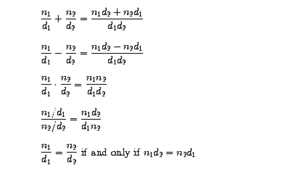

RationalArithmetic
==================

TDDing RationalArithmetic

Problem Statement : 

Implement a Rational class supporting the following operations:

(Note: number should be reduced to lowest terms)

